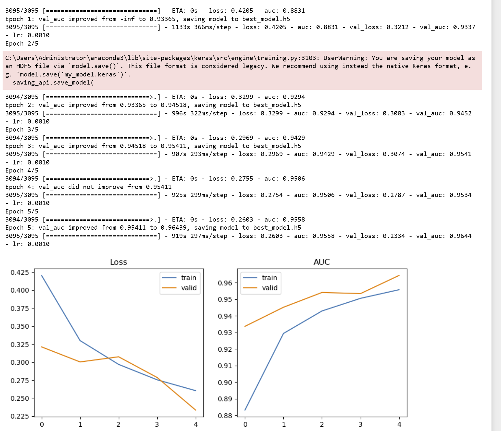
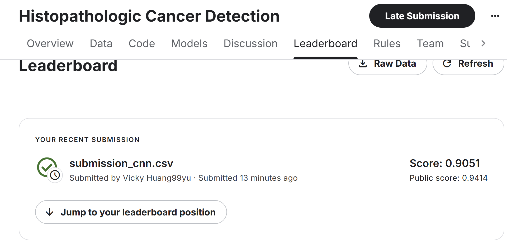

# CNN Histopathologic Cancer Detection

**Public Leaderboard AUC:** 0.9414 

CNN-based histopathologic cancer detection project for Kaggle dataset.  
Includes EDA, model building, training, evaluation, and discussion.  
Developed as part of Coursera's Advanced Machine Learning course.

## Files
- `CNN-Based Histopathologic Cancer Detection.ipynb` — Main training & inference notebook  
- `submission_cnn.csv` — Kaggle submission file  
- `README.md` — Project documentation  

## Training Summary
The model was trained for **5 epochs** in a CPU-only environment.  
Validation AUC progression:
- Epoch 1: ~0.88  
- Epoch 2: ~0.93  
- Epoch 3: ~0.95  
- Epochs 4–5: Stable between 0.95–0.96  

Early stopping was not triggered, but `ModelCheckpoint` was used to save the best-performing model (highest validation AUC).  

**Training Curve & AUC Plot:**  
  

## Kaggle Score
- Public leaderboard AUC: **0.9414**  

**Kaggle Submission Screenshot:**  
  

## References
- [Kaggle Competition Page](https://www.kaggle.com/competitions/histopathologic-cancer-detection/leaderboard#)
